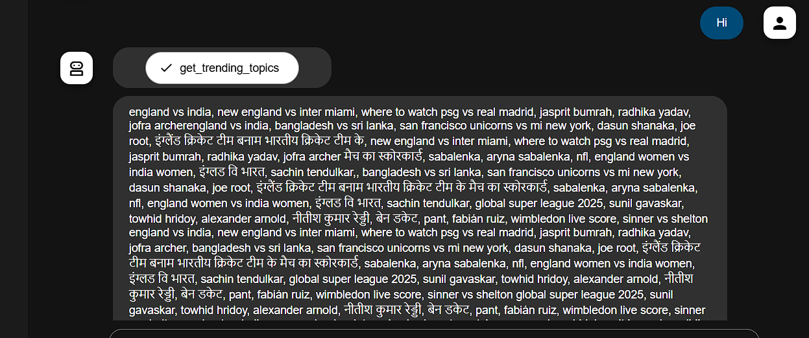
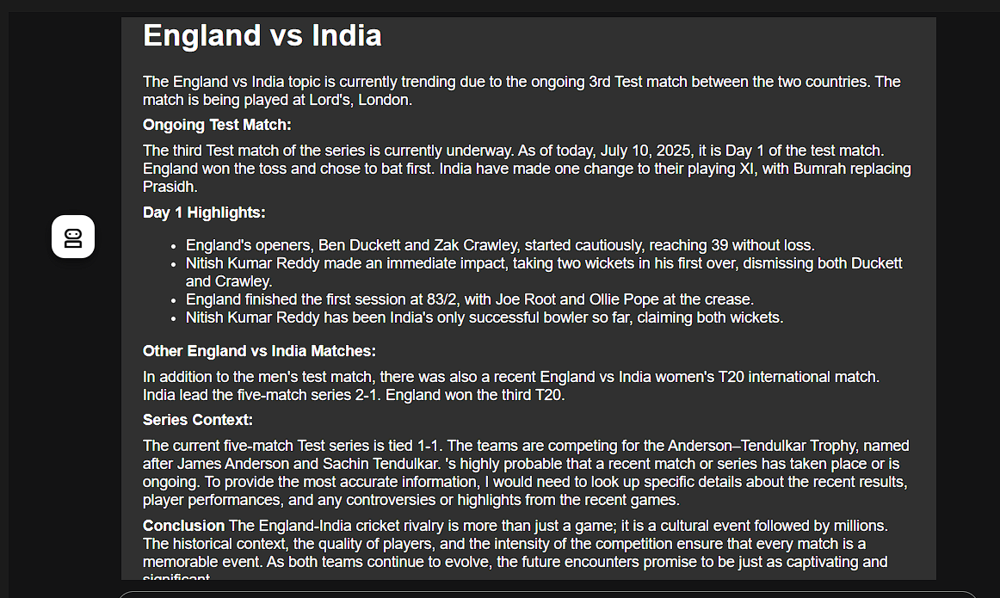

# WhatsAI - Auto Blogger AI Agent

WhatsAI is a modular, multi-agent AI system that automates the end-to-end workflow of trending blog generation. It identifies trending topics, extracts relevant information from top-performing sources, and generates detailed, high-quality blog posts using large language models.

## Features

- **Trend Discovery:** Automatically scrapes Google Trends to identify popular and timely topics.
- **Content Aggregation:** Retrieves relevant information from multiple top-ranked websites using web crawling and custom scraping.
- **AI Blog Generation:** Crafts unique, structured blog posts in JSON format using Gemini APIs.

## System Architecture

The system is built using a **sequential multi-agent architecture**, where each agent performs a specific task and passes structured data to the next:

1. **Trend Finder** – Extracts real-time trending topics from Google Trends.
2. **Content Finder** – Searches the web for relevant articles and scrapes the content.
3. **Blog Writer** – Uses Gemini LLMs to generate blog posts in structured JSON format.

### Architecture Flow

```

Trend Finder → Content Finder → Blog Writer → JSON Blog Output

````

## 🖼️ Workflow Screenshots

### 1. Fetching Trending Topics from Google Trends



---

### 2. Scraping Content from Multiple Sources



---

### 3. Generated Blog Output in JSON Format


---

## 🛠️ Tech Stack

- **Programming Language:** Python  
- **Search & Data Aggregation:** Google-ADK, Crawl4AI  
- **Notebook Integration:** Jupyter Notebook  
- **AI Model:** Gemini APIs  

## 📁 Output Format

The blog output is stored in a clean JSON format with the following structure:

```json
{
  "title": "Top Trends in AI for 2025",
  "subheadings": [
    {
      "heading": "The Rise of Autonomous Agents",
      "content": "Autonomous AI agents are transforming industries by..."
    },
    {
      "heading": "LLMs in Healthcare",
      "content": "Language models are now being integrated into diagnostics..."
    }
  ],
  "references": [
    "https://example.com/top-ai-trends",
    "https://anotherexample.com/autonomous-agents"
  ],
  "created_at": "2025-07-10"
}
````
#### Thank You!